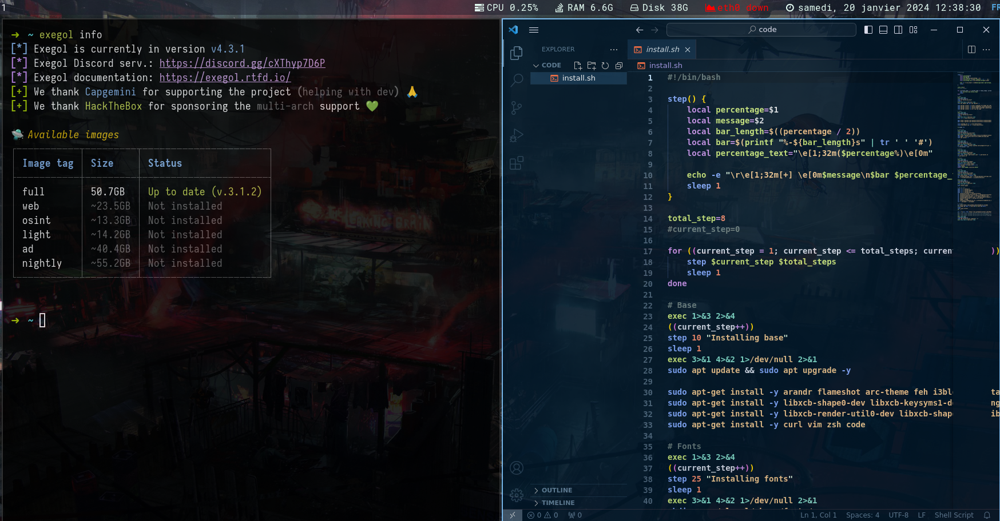

# fork of the xct env with personal tweaks :
- redesign of the installation script
- increase font size
- installation of additional tools :
  - [fzf](https://github.com/junegunn/fzf)
  - [docker](https://www.docker.com/)
  - [exegol](https://github.com/ThePorgs/Exegol)
  - [vscode](https://code.visualstudio.com/)

- wallpaper cyberpunk



## Installation

```
./install.sh
```

## Fix
- tools install (tools.txt)
- fix vscode extensions
- fix exegol and input
